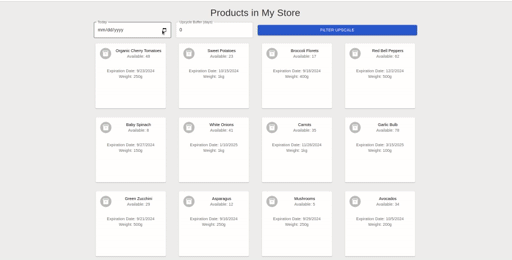

# PizzaUp

> Code from hackfestival-schwarz-it-challenge 2024

## Getting Started

* Start backend (django + postgres, needs docker)

```sh
cd docker
start_backend.sh
```

* Start frontend (react dev server)

```sh
cd frontend/pizza-up/
npm start 
```

* Open web UI in [http://localhost:3000](http://localhost:3000)

> Chose "Today" and window of upcycle, select upcycle products and send to backend.

# Demo

⬜ Good | 🟥 Expired | 🟨 UPCYCLE Possible | 🟩 Sent for upcycle



# Team

* **[Valdilene Silva Siqueira](https://www.linkedin.com/in/valdilenesiqueira/)**


* **[Gabriele Ermacora](https://www.linkedin.com/in/gabriele-ermacora-phd/)**


* **[Alexandru But](https://www.linkedin.com/in/alexandrubut/)**

